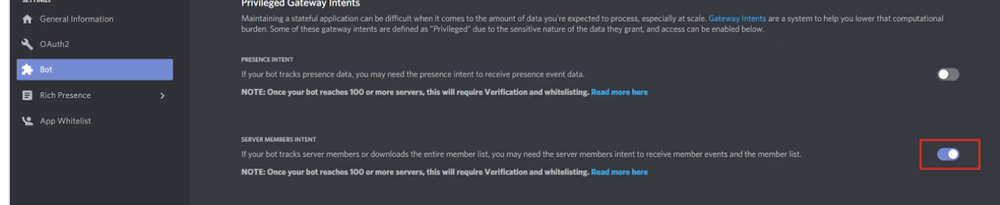

```
python3 -m pip install -r requirements.txt
```
```
sudo discord-translate-bot.service /etc/systemd/system/
sudo systemctl daemon-reload
sudo systemctl enable discord-translate-bot.service
sudo systemctl start discord-translate-bot.service
```

### cert
.com:443 ssl:True [SSLCertVerificationError: (1, '[SSL: CERTIFICATE_VERIFY_FAILED] certificate verify failed: unable to get local issuer certificate (_ssl.c:997)')]
```
/Applications/Python\ 3.10/Install\ Certificates.command
```

# Bot
Shard ID None is requesting privileged intents that have not been explicitly enabled in the developer portal. It is recommended to go to https://discord.com/developers/applications/ and explicitly enable the privileged intents within your application's page. If this is not possible, then consider disabling the privileged intents instead.

